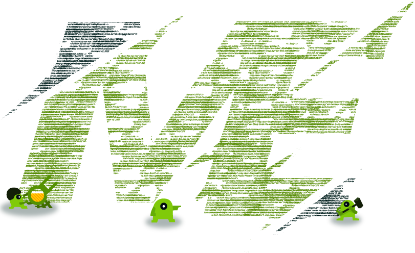
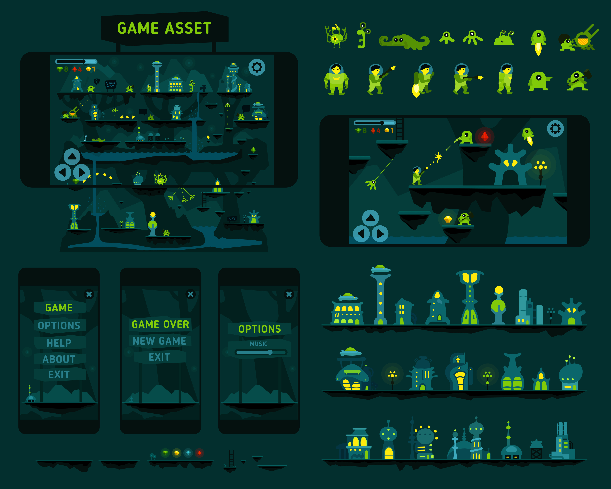
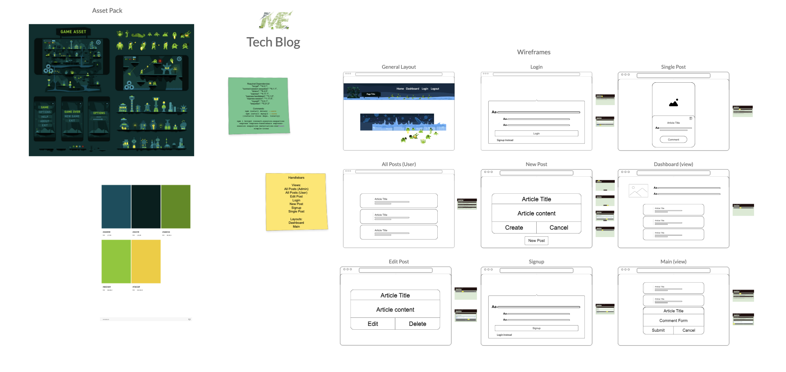

  <!-- Add badges using the following format: -->
  <!-- (urlToGithubHere) -->

<!-- PROJECT LOGO -->

  

<h3 align="center">Alien Tech Blog</h3>

  

Full Stack Tech Blog using an alien themed game asset pack found from Adobe Stock. It will use MySQL backend, Express frontend, and Sequelize ORM.    
    <a href="https://github.com/404pandas/404pandas.github.io"><strong>Explore the docs »</strong></a>
     
     
    <a href="https://github.com/404pandas/404pandas.github.io">View Demo(Broken)</a>
    ·
    <a href="https://github.com/404pandas/404pandas.github.io/issues">Report Bug</a>
    ·
    <a href="https://github.com/404pandas/404pandas.github.io/issues">Request Feature</a>
  

<!-- TABLE OF CONTENTS -->

  
Table of Contents

  <ol>
    <li>
      <a href="#about-the-project">About The Project</a>
      <ul>
        <li><a href="#built-with">Built With</a></li>
      </ul>
    </li>
    <li>
      <a href="#getting-started">Getting Started</a>
      <ul>
        <li><a href="#installation">Installation</a></li>
      </ul>
    </li>
    <li><a href="#usage">Usage</a></li>
    <li><a href="#roadmap">Roadmap</a></li>
    <li><a href="#contributing">Contributing</a></li>
    <li><a href="#license">License</a></li>
    <li><a href="#contact">Contact</a></li>
    <li><a href="#acknowledgments">Acknowledgments</a></li>
  </ol>

<!-- ABOUT THE PROJECT -->

## About The Project

<!-- Add screenshots using the following format: -->
<!--  -->

This project is to show how I would design a full stack blog. It's design is pulled from the following asset pack on Adobe Stock. To view the asset pack, click on the image.

  

### Built With

<!--  npm packages- npm i bcrypt connect-session-sequelize express express-handlebars express-session sequelize materialize-css@next simple-icons dotenv mysql2 -->
<!-- other- vs code, npm, node.js, materialize, js, css, html, heroku -->

<!-- GETTING STARTED -->

## Getting Started

Once completely built, this application will function as a deployed app on Heroku

### Installation

1. Clone the repo
   git clone https://github.com/404pandas/404pandas.github.io.git

<!-- USAGE EXAMPLES -->

## Usage

Once the app is functional, screenshots will be added in this section.

<!-- ROADMAP -->

## Roadmap

  

Click on this image to be redirected to my planning whiteboard for this project

### Technical

Technical

- [ ] Satisfies all of the following acceptance criteria:
  - [ ] When I visit the site for the first time, then I am presented with the homepage, which includes existing blog posts if any have been posted; navigation links for the homepage and the dashboard; and the option to log in
  - [ ] When I click on the homepage option, then I am taken to the homepage
  - [ ] When I click on any other links in the navigation, then I am prompted to either sign up or sign in
  - [ ] When I choose to sign up, then I am prompted to create a username and password
  - [ ] When I click on the sign-up button, then my user credentials are saved and I am logged into the site
  - [ ] When I revisit the site at a later time and choose to sign in, then I am prompted to enter my username and password
  - [ ] When I am signed in to the site, then I see navigation links for the homepage, the dashboard, and the option to log out
  - [ ] When I click on the homepage option in the navigation, then I am taken to the homepage and presented with existing blog posts that include the post title and the date created
  - [ ] When I click on an existing blog post, then I am presented with the post title, contents, post creator’s username, and date created for that post and have the option to leave a comment
  - [ ] When I enter a comment and click on the submit button while signed in, then the comment is saved and the post is updated to display the comment, the comment creator’s username, and the date created
  - [ ] When I click on the dashboard option in the navigation, then I am taken to the dashboard and presented with any blog posts I have already created and the option to add a new blog post
  - [ ] When I click on the button to add a new blog post, then I am prompted to enter both a title and contents for my blog post
  - [ ] When I click on the button to create a new blog post, then the title and contents of my post are saved and I am taken back to an updated dashboard with my new blog post
  - [ ] When I click on one of my existing posts in the dashboard, then I am able to delete or update my post and taken back to an updated dashboard
  - [ ] When I click on the logout option in the navigation, then I am signed out of the site
  - [ ] When I am idle on the site for more than a set time, then I am able to view comments but I am prompted to log in again before I can add, update, or delete comments
- [ ] Follows the Model-View-Controller paradigm.
- [ ] Uses Handlebars
- [ ] Deployed to Heroku.

### Deployment

Deployment

- [ ] Deployed at live site
- [ ] Loads with no errors.
- [ ] GitHub repo contains code.

### Application

Application

  - [ ] User experience is intuitive and easy to navigate.
  - [ ] UI clean and polished.
  - [ ] Resembles mock-up functionality

### Repository Quality

Repository Quality

  - [ ] Repo has a unique name.
  - [ ] Repo follows best practices for file structure and naming conventions.
  - [ ] Repo follows best practices for class/id naming conventions, indentation, quality comments, etc.
  - [ ] Repo contains multiple descriptive commit messages.
  - [ ] Repo contains quality readme file with description, screenshot, and link to deployed application.

See the [open issues](https://github.com/404pandas/404pandas.github.io/issues) for a full list of proposed features (and known issues).

<!-- CONTRIBUTING -->

## Contributing

Contributions are what make the open source community such an amazing place to learn, inspire, and create. Any contributions you make are **greatly appreciated**.

If you have a suggestion that would make this better, please fork the repo and create a pull request. You can also simply open an issue with the tag "enhancement".
Don't forget to give the project a star! Thanks again!

1. Fork the Project
2. Create your Feature Branch (git checkout -b feature/AmazingFeature)
3. Commit your Changes (git commit -m 'Add some AmazingFeature')
4. Push to the Branch (git push origin feature/AmazingFeature)
5. Open a Pull Request

<!-- LICENSE -->

## License

This project is licensed under the MIT license.

See LICENSE.txt for more information.

<!-- CONTACT -->

## Contact

Mary Elenius - mary.panda.jackson@gmail.com

Website: [https://404pandas.github.io](https:/404pandas.github.io)

Linkedin: [https://linkedin.com/in/404pandas](https://linkedin.com/in/404pandas)

Github: [https://github.com/404pandas](https://github.com/404pandas)

<!-- ACKNOWLEDGMENTS -->

## Acknowledgments

I would like to give a big shoutout to my partner in crime and daughter, Yennefer! Every day she proves she is small yet mighty!
